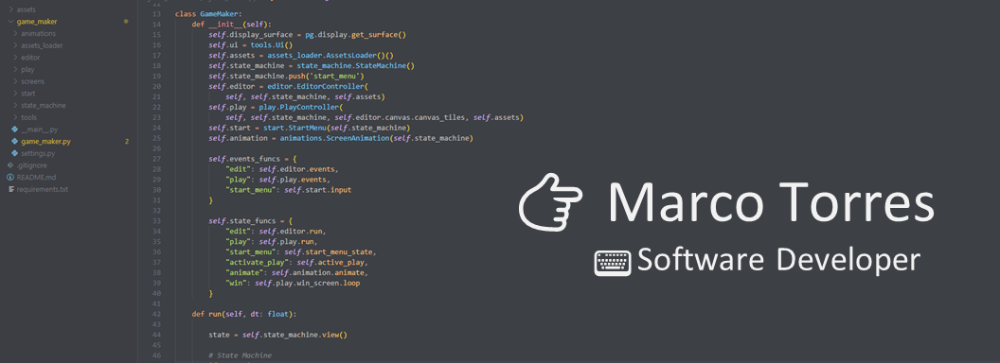

# Hi, I'm Marco Torres
### Software Developer | Python

### 🛠️ Languages and Tools

## Languages

  </a>

## Version control system

## Backend

 

## Database

    

## Data

 <a href="https://seaborn.pydata.org/" target="_blank" rel="noreferrer">   

## System

  

## Others

  
